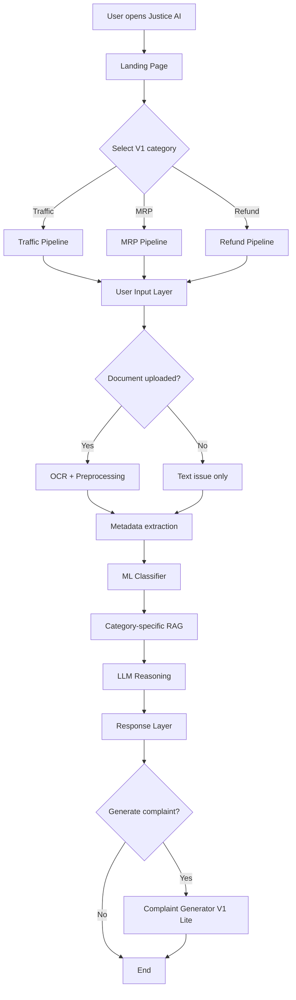
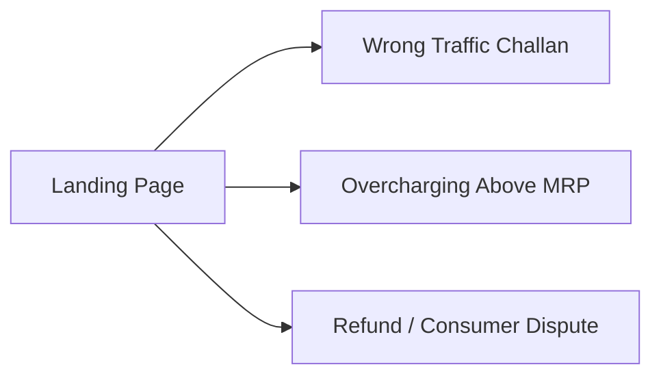
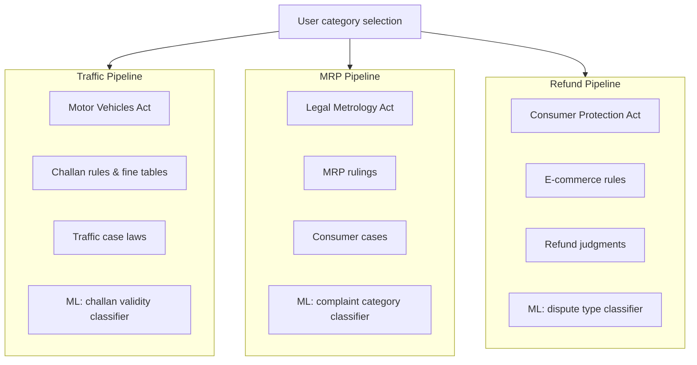
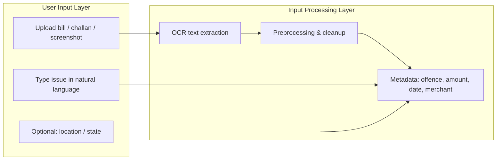
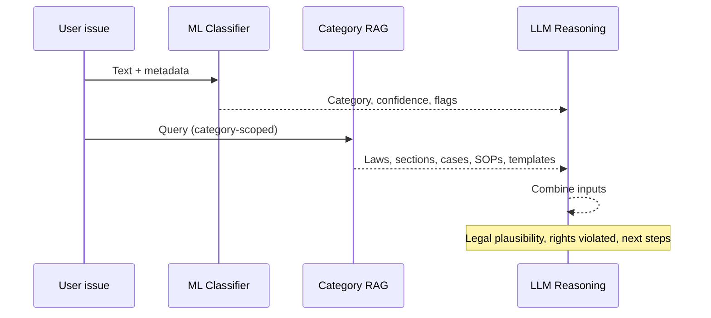
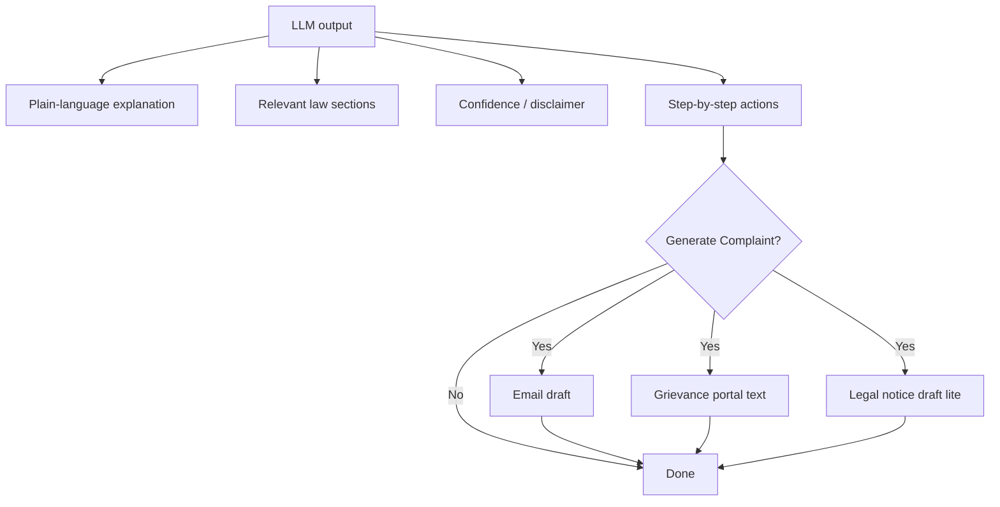
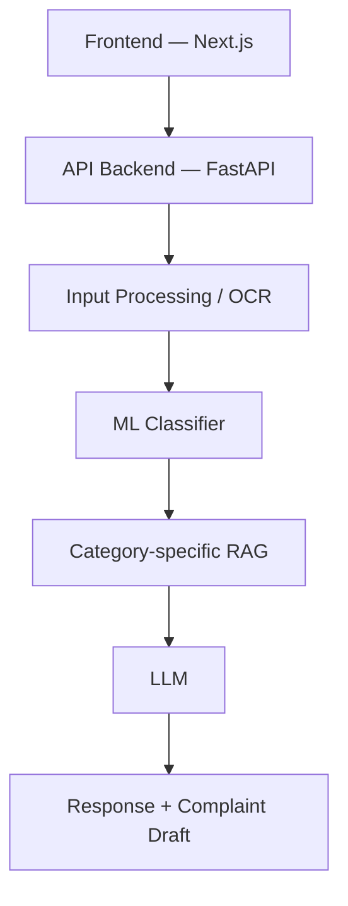

# Justice AI (Layer AI)

**Layer AI V0.5** is an AI-powered legal assistance platform focused on solving small-scale consumer and traffic-related disputes in India. Instead of generic legal chat, the system routes each case through **category-specific workflows** backed by dedicated RAG pipelines trained on Indian legal acts, case laws, and government procedures.

Users can describe their issue in plain language or upload challans, bills, or screenshots. The platform runs **OCR**, lightweight **ML classifiers**, and **retrieval-augmented generation (RAG)** before an LLM produces actionable guidance: relevant law references, step-by-step remedies, and draft complaints where appropriate.

**V1 scope (this HLD):** Wrong traffic challans, overcharging above MRP, and refund / consumer disputes. The design stays **deterministic and reliable**—no multi-agent orchestration in V1.

---

## Contributors

| Name | Role |
|------|------|
| **Sudhanshu Biswas** | Author & maintainer |

---

# Layer AI — V1 High-Level Design (HLD)

## End-to-end flow



---

## 1. Landing Page

User opens the platform and picks one of three V1 categories.



---

## 2. Category-based pipelines

Each category has its own RAG dataset, prompts, workflow, and optional ML module.



| Pipeline | Knowledge base | ML module |
|----------|----------------|-----------|
| Traffic | Motor Vehicles Act, challan rules, case laws, fine tables | Challan validity / suspicion classifier |
| MRP | Legal Metrology Act, MRP rulings, consumer cases | Complaint category classifier |
| Refund | Consumer Protection Act, e-commerce rules, refund judgments | Dispute type classification |

---

## 3–4. User input & processing



**Example input:** *“I got ₹2000 challan for no helmet but I was wearing one”*

---

## 5–7. ML, RAG & LLM reasoning



**ML example output:**

```txt
Category: Traffic
Confidence: 92%
Possible Wrong Fine: Yes
```

**RAG retrieves:** applicable laws & sections, case law snippets, SOPs, complaint templates.

---

## 8–9. Response & complaint generator



**Example response:**

```txt
This challan may be disputable because...
Relevant Section: [Act / Section]
Recommended Action:
1. File dispute on Parivahan
2. Attach helmet proof
3. Escalate if rejected
```

---

## V1 architecture summary



### Component responsibilities

| Layer | Technology (planned) | Responsibility |
|-------|----------------------|----------------|
| Frontend | Next.js | Category selection, uploads, chat UI, complaint export |
| API | FastAPI | Auth, routing, orchestration, rate limits |
| OCR / preprocessing | Tesseract / cloud OCR + rules | Text + metadata from documents |
| ML | Lightweight models (sklearn / small NN) | Category & anomaly signals |
| RAG | Per-category vector DB + embeddings | Law, cases, SOPs, templates |
| LLM | Hosted or self-hosted LLM | Reasoning, drafting, user-facing copy |

---

## Out of scope for V1

V1 does **not** include:

- Multi-agent orchestration
- Autonomous tool-calling workflows
- Long-running agent chains

Design principle for V1:

> **Deterministic + reliable** — predictable pipeline per category.

Agent-based automation is planned for **V2/V3**.

---

## Repository

This repository hosts the **Justice AI / Layer AI** project documentation and implementation. The remote is:

[https://github.com/SudhanshuBiswas01/Justice-AI](https://github.com/SudhanshuBiswas01/Justice-AI)

---

## License

To be determined.
