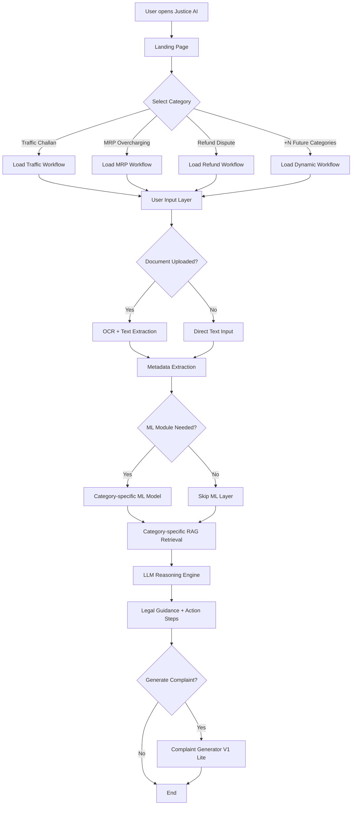
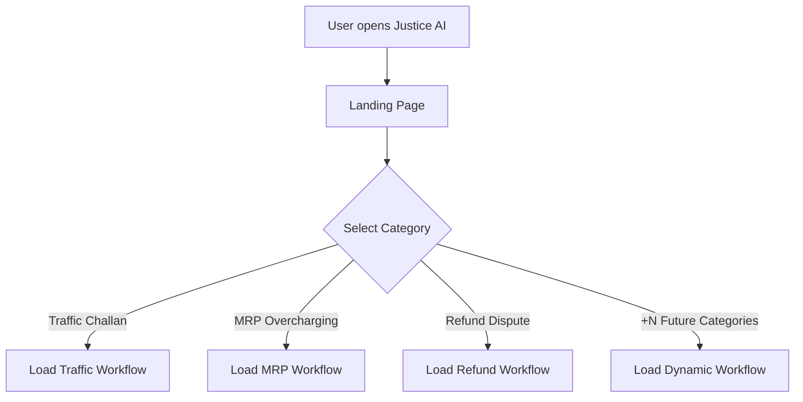
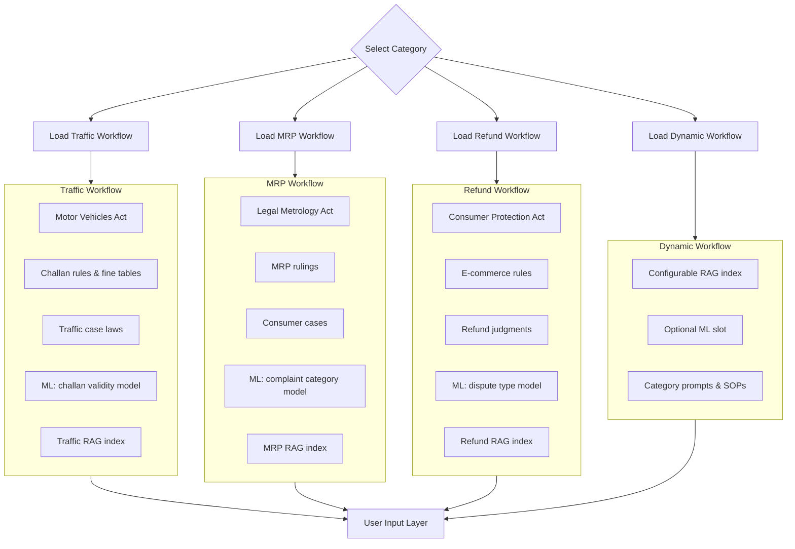
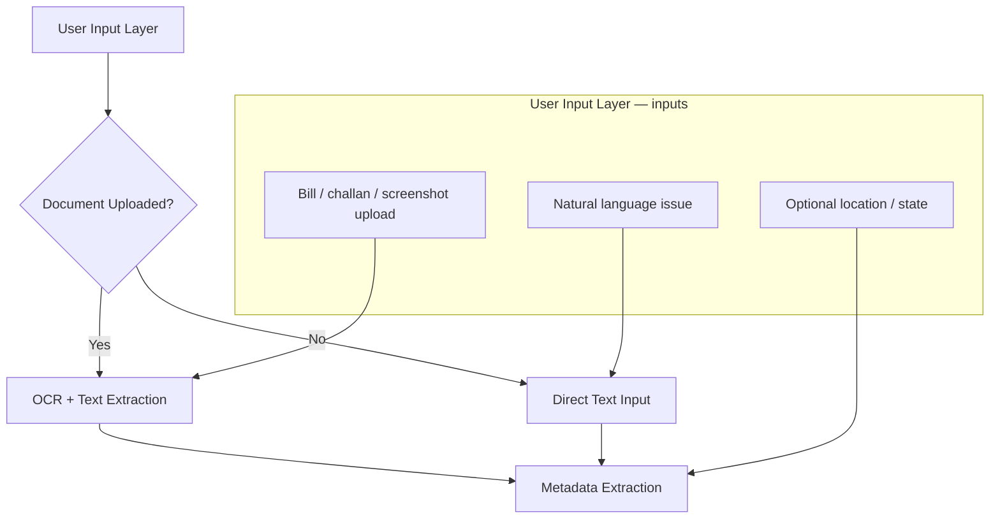
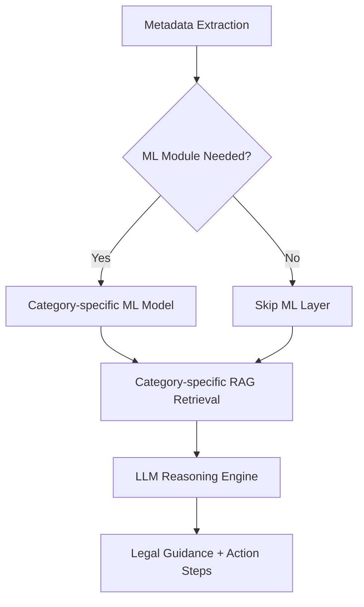
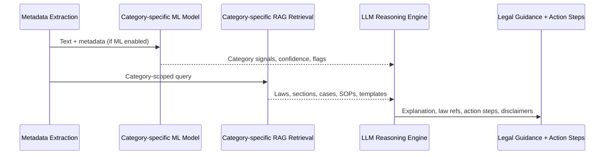
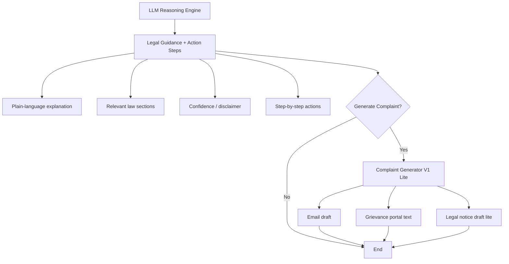
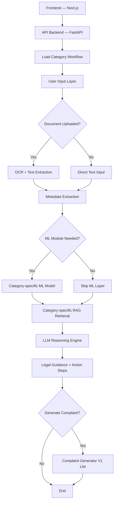

# Justice AI (Layer AI)

**Layer AI V0.5** is an AI-powered legal assistance platform focused on solving small-scale consumer and traffic-related disputes in India. Instead of generic legal chat, the system routes each case through **category-specific workflows** backed by dedicated RAG pipelines trained on Indian legal acts, case laws, and government procedures.

Users can describe their issue in plain language or upload challans, bills, or screenshots. The platform runs **OCR**, lightweight **ML classifiers**, and **retrieval-augmented generation (RAG)** before an LLM produces actionable guidance: relevant law references, step-by-step remedies, and draft complaints where appropriate.

**V1 scope (this HLD):** Wrong traffic challans, overcharging above MRP, and refund / consumer disputes. The design stays **deterministic and reliable**—no multi-agent orchestration in V1.

---

## Contributors

| Name | Role |
|------|------|
| **Sudhanshu Biswas** | Author & maintainer |

---

## Getting Started & Setup Guide

This guide will walk you through setting up both the backend API and the frontend application, as well as running the interactive RAG evaluation test suite.

### Prerequisites
Ensure you have the following installed on your local machine:
- **Python 3.8+** (for the backend and RAG evaluation)
- **Node.js 18+** & **npm** (for the Next.js frontend)

---

### 1. Backend Setup (FastAPI)

The backend is built with FastAPI and integrates with the Groq API for LLM reasoning.

1. **Navigate to the backend directory:**
   ```bash
   cd backend
   ```

2. **Create and activate a virtual environment:**
   - **macOS/Linux:**
     ```bash
     python3 -m venv venv
     source venv/bin/activate
     ```
   - **Windows:**
     ```bash
     python -m venv venv
     venv\Scripts\activate
     ```

3. **Install dependencies:**
   ```bash
   pip install -r requirements.txt
   ```

4. **Configure Environment Variables:**
   Create a `.env` file in the `backend/` directory (or edit the existing one) with your API key:
   ```env
   GROQ_API_KEY=your_groq_api_key_here
   ```

5. **Run the FastAPI development server:**
   ```bash
   uvicorn main:app --reload
   ```
   The backend server will run on [http://localhost:8000](http://localhost:8000).

---

### 2. Frontend Setup (Next.js)

The frontend is a dark-themed interactive legal dashboard built with Next.js 15, React 19, and Tailwind CSS 4.

1. **Navigate to the frontend directory:**
   ```bash
   cd frontend
   ```

2. **Install dependencies:**
   ```bash
   npm install
   ```

3. **Run the Next.js development server:**
   ```bash
   npm run dev
   ```
   The frontend application will start running on [http://localhost:3000](http://localhost:3000). Open this URL in your browser to interact with Justice AI.

---

### 3. Running RAG Evaluations (Interactive CLI)

The project includes an interactive RAG evaluation test suite in `backend/test/test.py` that utilizes Ragas to score LLM outputs across different legal question categories.

1. **Activate the backend virtual environment** and ensure your keys are configured.
2. **Navigate to the backend folder and run the test runner:**
   ```bash
   cd backend
   python test/test.py
   ```
3. **Select an evaluation option** from the interactive CLI menu.

---

# Layer AI — V1 High-Level Design (HLD)

## End-to-end flow

Primary system flow (author design):



---

## 1. Landing page & category selection



**V1 categories:** Traffic Challan, MRP Overcharging, Refund Dispute.  
**Future:** `+N` categories plug into a **Dynamic Workflow** loader without changing the core pipeline.

---

## 2. Category workflows

Each loaded workflow bundles its own RAG dataset, prompts, SOPs, and optional ML model.



| Workflow | Knowledge base | ML (when needed) |
|----------|----------------|------------------|
| Traffic | Motor Vehicles Act, challan rules, case laws, fine tables | Challan validity / suspicion model |
| MRP | Legal Metrology Act, MRP rulings, consumer cases | Complaint category model |
| Refund | Consumer Protection Act, e-commerce rules, refund judgments | Dispute type model |
| Dynamic (+N) | Plug-in acts, rules, templates per new category | Optional per category config |

---

## 3–4. User input & document processing



**Metadata extracted:** offence type, amount, date, merchant/platform, state, and other category-specific fields.

**Example:** *“I got ₹2000 challan for no helmet but I was wearing one”*

---

## 5–7. ML, RAG & LLM reasoning engine

ML runs only when the workflow defines it (`ML Module Needed?`).





**ML example output (Traffic):**

```txt
Category: Traffic
Confidence: 92%
Possible Wrong Fine: Yes
```

---

## 8–9. Legal guidance & complaint generator



**Example output:**

```txt
This challan may be disputable because...
Relevant Section: [Act / Section]
Recommended Action:
1. File dispute on Parivahan
2. Attach helmet proof
3. Escalate if rejected
```

---

## V1 architecture summary



### Component responsibilities

| Layer | Technology (planned) | Responsibility |
|-------|----------------------|----------------|
| Frontend | Next.js | Landing page, category selection, workflow routing, uploads, complaint export |
| API | FastAPI | Load category workflow, auth, orchestration, rate limits |
| OCR + text extraction | Tesseract / cloud OCR + rules | Document → text when upload present |
| Metadata extraction | Rules + parsers | Offence, amount, date, merchant, state, etc. |
| ML (optional) | Per-category lightweight models | Run only when `ML Module Needed?` is true |
| RAG | Per-category vector DB + embeddings | Category-specific RAG retrieval |
| LLM | Hosted or self-hosted LLM | LLM reasoning engine → legal guidance + action steps |
| Complaint generator | Prompt templates | Complaint Generator V1 Lite (email, grievance, notice) |

---

## Out of scope for V1

V1 does **not** include:

- Multi-agent orchestration
- Autonomous tool-calling workflows
- Long-running agent chains

Design principle for V1:

> **Deterministic + reliable** — predictable pipeline per category.

Agent-based automation is planned for **V2/V3**.

---

## Repository

This repository hosts the **Justice AI / Layer AI** project documentation and implementation. The remote is:

[https://github.com/SudhanshuBiswas01/Justice-AI](https://github.com/SudhanshuBiswas01/Justice-AI)

---

## License

To be determined.
